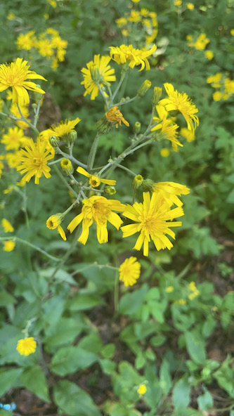

There's a bunch of bird songs I have a hard time with. They all sound like Purple Finches to me.

... many of which are edible, more (wild lettuce) or less (hawkweed?? I don't know).

And one of these will be deomonstrated here:

<iframe src="https://xeno-canto.org/817988/embed" width="340" height="220"></iframe>

After which text will follow.

