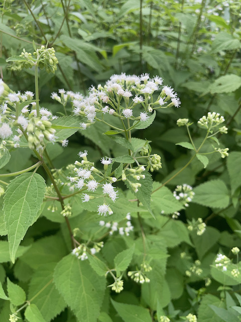

---
title: Straight as an arrow
subtitle: The mystery plan right in our faces
date: 2024-07-22T20:54:39.467Z
draft: false
featured: true
tags:
   - plants
#image:
#  filename: featured
#  focal_point: Smart
#  preview_only: false
--- 
This one stumped iSeek for a while, until the flowers came out. The arrow-straight stems made me think it'd be called arrowroot or something.

But it was the corymbs that caught my eye first when reading about it. Of course, you don't know what a corymb is. I'll wait a moment while I lord that over you ...

A corymb is the form that the white snakeroots flowers are in. The word comes from the Greek word for bunch of flowers. People spoke more plainly back then.

But the most interesting thing about this plant is that Abraham Lincoln might never have existed, had it killed his mom years earlier, rather than in 1818. The plant's potent poison got into cows back then, killing lots of people who ate the meat.